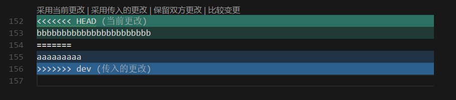

# git

## 安装

### windows

下载地址：[https://git-scm.com/downloads](https://git-scm.com/downloads)

安装完成后，自报家门

``` bash
git config --global user.name "Your Name"
git config --global user.email "email@example.com"
```

注意git config命令的--global参数，用了这个参数，表示你这台机器上所有的Git仓库都会使用这个配置，当然也可以对某个仓库指定不同的用户名和Email地址。

## SSH Key

创建 SSH Key

``` bash
ssh-keygen -t rsa -C "youremail@example.com"
```

1. 用户主目录里找到.ssh目录，里面有id_rsa和id_rsa.pub两个文件，这两个就是SSH Key的秘钥对，id_rsa是私钥，不能泄露出去，id_rsa.pub是公钥，可以放心地告诉任何人；

2. 登陆GitHub，打开“Account settings”，“SSH Keys”页面；

3. 然后，点“Add SSH Key”，填上任意Title，在Key文本框里粘贴id_rsa.pub文件的内容；

4. 点“Add Key”，你就应该看到已经添加的Key。

## 创建/拉取项目

### 关联远程仓库（不推荐）

``` bash
git remote add origin git@git.can-dao.com:sikychen/git-test.git
```

### 从远程仓库克隆

无论是新建项目，还是从远程仓库下载项目，都推荐克隆项目到本地。

#### 创建

- github: new repository
- gitlab: New Project
- ......

#### 克隆

``` bash
git clone git@git.can-dao.com:sikychen/git-test.git
```

## 多人协作

### 分支管理策略


- master：主分支。与远程库同步。每次 `commit` 到主分支后，都应该 `tag` 一个版本号；

  ``` bash
  git tag v6.0
  ```

- dev：开发分支。与远程库同步。所有小伙伴都在此分支工作。
- 个人分支：本地分支。不必与远程库同步。

### 克隆后在本地创建dev分支

克隆到本地的项目，应该只有 master 分支

``` bash
$ git branch
* master
```

要在dev分支上开发，就必须创建远程origin的dev分支到本地

``` bash
git checkout -b dev origin/dev # 创建远程 origin 的 dev 分支，并切换到该分支
```

在本地进行开发后，把修改提交到 dev 分支，并推送到远程 dev 分支

``` bash
git add readme.md # 将 readme.md 的修改添加到缓存区
git add .         # 将所有修改添加到缓存区

git commit -m "add readme"  # 将缓存区的修改提交到本地 dev 分支，并添加描述信息

$ git push origin dev # 将本地 dev 分支的修改推送到远程 dev 分支
Counting objects: 3, done.
Delta compression using up to 4 threads.
Compressing objects: 100% (2/2), done.
Writing objects: 100% (3/3), 308 bytes | 308.00 KiB/s, done.
Total 3 (delta 0), reused 0 (delta 0)
To github.com:michaelliao/learngit.git
   f52c633..7a5e5dd  dev -> dev
```

如果显示 done ，则推送成功。

### 本地与远程库有冲突

``` bash
$ git push origin dev
To github.com:michaelliao/learngit.git
 ! [rejected]        dev -> dev (non-fast-forward)
error: failed to push some refs to 'git@github.com:michaelliao/learngit.git'
hint: Updates were rejected because the tip of your current branch is behind
hint: its remote counterpart. Integrate the remote changes (e.g.
hint: 'git pull ...') before pushing again.
hint: See the 'Note about fast-forwards' in 'git push --help' for details.
```

如果显示 error ，则推送失败，说明你的提交与 dev 分支上其他人的最新提交有冲突，需要解决冲突后再提交。根据提示，用 `git pull` 拉取 dev 上的代码：

``` bash
$ git pull
There is no tracking information for the current branch.
Please specify which branch you want to merge with.
See git-pull(1) for details.

    git pull <remote> <branch>

If you wish to set tracking information for this branch you can do so with:

    git branch --set-upstream-to=origin/<branch> dev
```

这样的提示是 `git pull` 失败了，需要指定本地 dev 分支与远程 origin/dev 分支的链接，根据提示，设置 dev 和 origin/dev 的链接：

``` bash
$ git branch --set-upstream-to=origin/dev dev
Branch 'dev' set up to track remote branch 'dev' from 'origin'
```

然后再 `git pull` ：

``` bash
$ git pull
Auto-merging env.txt
CONFLICT (add/add): Merge conflict in env.txt
Automatic merge failed; fix conflicts and then commit the result.
```

拉取成功。此时有冲突，所以要手动解决冲突。跟 svn 解决冲突的方式一样。



解决冲突之后，提交，再 push

``` bash
git commit -m "fix conflict"

git push origin dev
```

## 查看提交历史

安装 Git History 插件可以方便的查看提交历史

F1 -> Git:View History (git log)

## 报错整理

push 的时候报如下错误

``` bash
@@@@@@@@@@@@@@@@@@@@@@@@@@@@@@@@@@@@@@@@@@@@@@@@@@@@@@@@@@@
@       WARNING: POSSIBLE DNS SPOOFING DETECTED!          @
@@@@@@@@@@@@@@@@@@@@@@@@@@@@@@@@@@@@@@@@@@@@@@@@@@@@@@@@@@@
The ECDSA host key for git.can-dao.com has changed,
and the key for the corresponding IP address 10.200.103.5
is unknown. This could either mean that
DNS SPOOFING is happening or the IP address for the host
and its host key have changed at the same time.
@@@@@@@@@@@@@@@@@@@@@@@@@@@@@@@@@@@@@@@@@@@@@@@@@@@@@@@@@@@
@    WARNING: REMOTE HOST IDENTIFICATION HAS CHANGED!     @
@@@@@@@@@@@@@@@@@@@@@@@@@@@@@@@@@@@@@@@@@@@@@@@@@@@@@@@@@@@
IT IS POSSIBLE THAT SOMEONE IS DOING SOMETHING NASTY!
Someone could be eavesdropping on you right now (man-in-the-middle attack)!
It is also possible that a host key has just been changed.
The fingerprint for the ECDSA key sent by the remote host is
SHA256:FHWw2nT9oCjbhVXBxFSxipCTFBCrI3A0Q+wDDBIK77w.
Please contact your system administrator.
Add correct host key in /c/Users/Siky Chen/.ssh/known_hosts to get rid of this message.
Offending ECDSA key in /c/Users/Siky Chen/.ssh/known_hosts:1
ECDSA host key for git.can-dao.com has changed and you have requested strict checking.
Host key verification failed.
fatal: Could not read from remote repository.

Please make sure you have the correct access rights
and the repository exists.
```

可能是服务器有更改，加密的密钥改变了，所以本机保存的你要就失效了，所以没有权限。需要重新保存密钥，密钥保存的位置在/user/.ssh/known_hosts。
解决办法：把该文件删掉，然后重新 pull 或者 push ，会提示输入密码，重新输入密码就好了。

## 小结

至此，应该可以完成：

- 安装 git
- 连接远程仓库
- 创建项目与克隆项目到本地
- 本地开发/修改代码后提交并推送到远程库
- 解决本地与代码仓库之间的冲突并再次提交
- 查看提交历史

待续：

- 临时 bug 分支
- 拉取（变基）
- 版本回退
- 缓存区的相关操作
- git 命令列表
- ...
